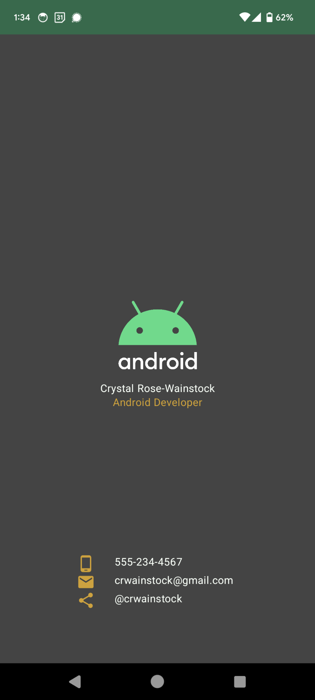

# 👩🏻‍💼 Android Business Card

This is one of my first Android app builds (yay!!). I built it as a part of the [Android Basics with Compose](https://developer.android.com/courses/android-basics-compose/course) course.

## 🛠️ Technologies

This little Android app was built using Android Studio. Prior to this build, I went through the Android Basics with Compose lessons and learned about building basic layouts in Android Studio with Compose.

This app uses a column structure to organize the content on the screen. There are two composable elements: the image/name/job title and the contact info section. The main image was provided by the course, but the icons were added by me with the help of the [Vector Asset Studio](https://developer.android.com/studio/write/vector-asset-studio#svg).

## 🤔 Reflection

Whew! This little guy took a while to put together. And honestly, the most challenging aspect was how slowly Android Studio is on my computer. 😣 But! With some patience, I got through it and put it together.

Another challenge for me is how tedious using Android Studio feels sometimes. I don't know if it's my settings (I had to turn on power saving mode to make things work slightly more quickly), but importing all of the ui elements and other things that are needed to put everything together is kind of a hassle.
